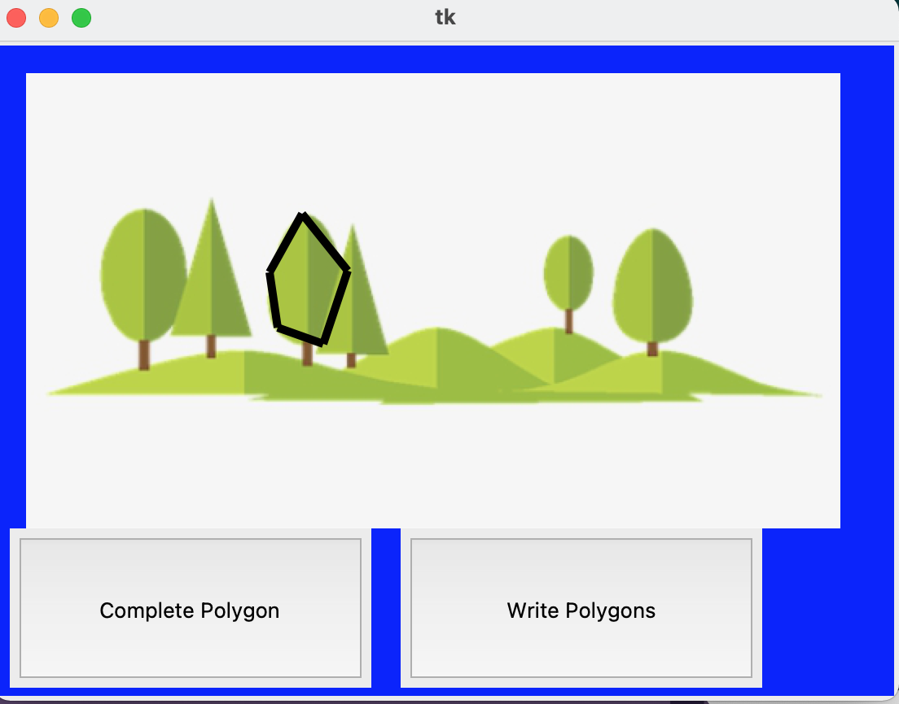

# PolygonAnnotationTool

Polygon annotation tool : customizable tool kit for annotating 
polygons on the screen (given image on any canvas)

## Features

### Image

In the demo above, there is a given image of vector graphic trees
as a stock image. The polygon annotation tool would work on all
kind of images, though currently the custom image import feature
is disabled

### Create Polygon

Start by clicking (left mouse button click) anywhere on the screen 
as a starting point for the current polygon. Keep on adding points
to the current polygon by clicking (left mouse button click) on the
canvas. As you keep on clicking, you will see a black line that
gets created from the last point added to the current point clicked 
for the current polygon

### Complete current polygon

To complete the current polygon after all the points have been added
(note a polygon must have >=3 points and the tool will warn you if
you add less than 3 points), click on the "Complete Polygon" button.
It will add the final line from the last point added in the current
polygon to the first point added for the current polygon

To add a new polygon, simply start clicking on another area of the
canvas where you desire the next polygon to be and follow the steps 
in the *Create Polygon* section

### Write polygons to text file

To write all the create polygons to a text file, (default "data.txt")
click on the "Write Polygons" button. It will write all the points
in the all the polygons added so far in the canvas to the text file
"data.txt"
